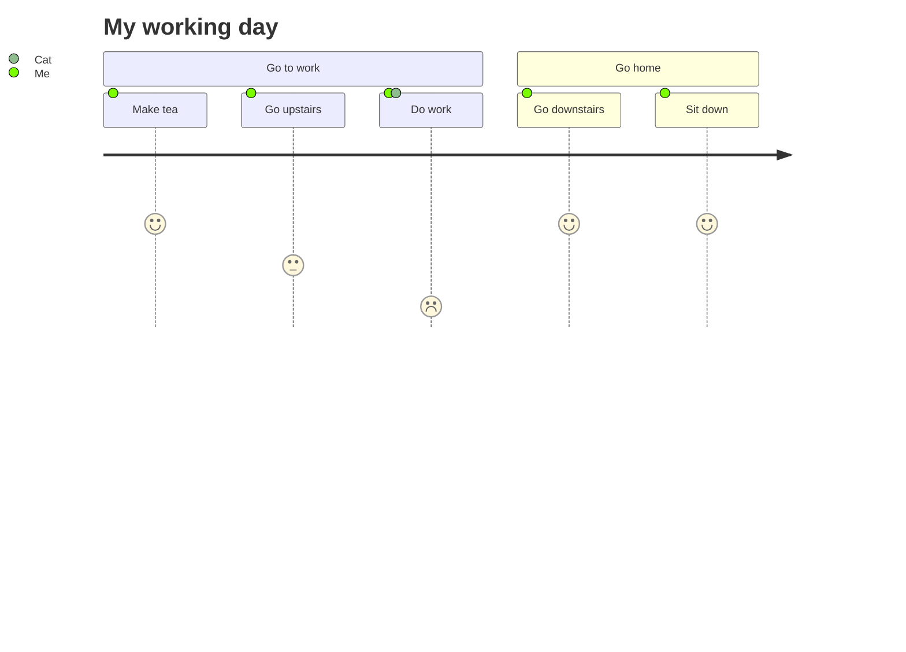
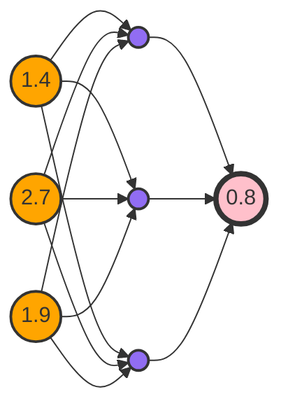

# TIPS  
```ad-col2
这是Blue Topaz的演示库，最新版本建议从社区商店更新。附带了Style Settings插件与Admonition插件。目前支持Live preview模式同时附带了其他一些插件，可供使用。
需要特别说明的是Codemirror插件，这个插件因为样式比较复杂多变，使用此插件会可能会出现样式上的bug。这里会给出一些Blue Topaz的展示、以及一些特别的用法，希望对你有帮助。

我不确定这个库会被传播到何处，所以给一个发布的QQ群号，也是Topaz社区所在的地方**908688452**。
开始部分的最后，感谢Topaz社区的各位，没有社区的各位，不会有现在的主题。这个主题献给他们。
```
## 强调

在笔记中，不可避免的会用到一些强调方式，比如加粗、高亮等等，这里做一个展示：
*斜体*
**加粗**
***加粗斜体***
`行内代码（也会被人当作强调方式使用）`
==高亮==
==*斜体高亮*==
*==符号反过来也行==*
==**加粗高亮**==
==***加粗斜体高亮***==
==高亮`行内代码`== (有点怪是吧= =||)

````ad-question
title: 想要更多的高亮方式？
collapse: true
下面的css代码保存成片段即可使用。 [如何使用片段](obsidian://open?vault=Obsidian%20Help&file=%E4%BD%BF%E7%94%A8%E6%8C%87%E5%8D%97%2F%E6%B7%BB%E5%8A%A0%E8%87%AA%E5%AE%9A%E4%B9%89%E4%B8%BB%E9%A2%98)
```css
/*实现下面语法高亮颜色不同
多色高亮1     _==foobar==_  
多色高亮2     __==foobar==__
*/
.markdown-preview-view em > mark, span.cm-em.cm-highlight {
  background-color: rgb(255, 248, 152);
}

span.cm-strong.cm-highlight, .markdown-preview-view strong > mark {
  background-color: rgb(147, 255, 228);

}
```
````


---

```ad-tip
这些强调的使用方式当然是由你决定的，但我建议不要使用过多的强调方式，选择两三种强调方式，赋予它们某种特别含义，保持笔记中用法的一致性。
```

## 标签
主题中普通标签颜色有九种，颜色按标签位置确定，即使是连续使用相同标签，还是会有各种颜色，如果不喜欢，可以在Style Settings插件里面手动更改颜色。
#tag #tag #tag #tag #tag #tag 

同时，主题里面提供了一些特别标签，它们有着与一般标签不同的外观，如果你需要更多的特别标签，你可以打开css文件，按照这些标签的写法，替换关键词，自己制作属于自己的特别标签。

#dailynote #weeklynote
#ideas #questions
#重要 #完成 #进行中 
#important #complete #inprogress 

---

```ad-tip
至于标签的用法，使用双链和标签的区别。这些不在这个演示库的讨论范围，[具体看帮助](obsidian://open?vault=Obsidian%20Help&file=%E4%BD%BF%E7%94%A8%E6%8C%87%E5%8D%97%2F%E6%A0%87%E7%AD%BE%E7%9A%84%E4%BD%BF%E7%94%A8)我相信每个人的用法可能不会完全一样，如果不清楚，可以在开始的时候同时使用双链和标签，一段时间以后，形成了自己的使用偏好，再做调整就好，没下笔之前就想着“完美”的笔记格式不是个好办法。
```
---

## 自定义的文本框
### 多彩背景
*移植自Notation主题 @deathau*

用法：`note-xxx-bg`  或者 `note-xxx-background`，当然，前者更方便

```note-orange-bg
text
```

```note-yellow-bg
text
```

```note-green-bg
text
```

```note-blue-bg
text
```

```note-purple-bg
text
```

```note-pink-bg
text
```

```note-red-bg
text
```

```note-gray-bg
text
```

```note-brown-bg
text
```
-----------------------------------------------------

### 多彩文字
用法: `note-color` 

```note-orange
text
```

```note-yellow
text
```

```note-green
text
```

```note-blue
text
```

```note-purple
text
```

```note-pink
text
```

```note-red
text
```

```note-gray
text
```

```note-brown
text
```


---
### 回顾、隐藏文本
#### 第一种，鼠标长按
可以点击To Recall下方长条，显示隐藏的文本

```note-cloze
text
```


#### 第二种，鼠标悬浮
```hibox
打群主，分bug
```

```ad-tip
admonition里也设置了这种样式，需要在Style Settings插件里启用
并且在Admonition插件里设置才可以
```

```ad-hibox
- [ ] 打群主，分bug
```

### 第三种，涂黑挖空
Lorem ipsum dolor sit amet, consectetur ==~~adipiscing~~== elit, sed do ==~~eiusmod~~== tempor incididunt ut labore et dolore magna aliqua. （`==~~xx~~==`鼠标悬浮触发）

Lorem ipsum dolor sit amet, consectetur *==~~adipiscing~~==* elit, sed do *==~~eiusmod~~==* tempor incididunt ut labore et dolore magna aliqua. （`*==~~xx~~==*`点击触发）


### 重要文本框
也没什么特别的

```note-imp
text
```

---

```ad-tips
这些用法算是给强调文字做一个补充，但是更多的可能是娱乐性质。
```


## 图片


插入的图片默认是居中显示，点击图片可以放大
![[obsidian_image.png]]

在图片后加上`|数字`可以控制图片大小

![[obsidian_image.png|120]]

在图片后加上`|R`或`|L`，可以控制图片居右还是居左，也可以跟上面的控制大小同时使用。
![[obsidian_image.png|R|150]]
另外，以下形式都可以使用，同一行的四种输入方式，效果都是一样的

`left`/`Left`/`LEFT`/`L`
![[obsidian_image.png|L|100]]
![[obsidian_image.png|Left|100]]


`right`/`Right`/`RIGHT`/`R`
![[obsidian_image.png|RIGHT|100]]
![[obsidian_image.png|right|100]]

---

###  ``格式的图片

形如``格式的图片也可以使用这种方式进行控制。限于软件原因，如果不能即时显示，对页面进行左右拆分即可。
#### 缩放
这是``格式图片的缩放效果演示

#### 左右对齐
这是``格式图片的右对齐效果演示 
`right`/`Right`/`RIGHT`/`R` 这类写法都是支持的

`left`/`Left`/`LEFT`/`L` 这类写法都是支持的

十十十十十十十十十十十十十十十十十十十十十十十十十十十十十十十十十十十十十十十十十十十十十十十十十十十十十十十十十十十十十十十十十十十十十十十十十十十十十十十十十十十十十十十十十十十十十十十十十十十十十十十十十十十十十十十十十十十十十十十十十十十十十十十十十十十十十十十十十十十十十十十十十十十十十十十十十十十十十十十十十十十十十十十十十十十十十十十十十十十十十十十十十十十十十十十十十十十十十十十十十十
#### 行内左右对齐

 `inlineR`/`InlineR`/`INLINER`/`inlR` 这类写法都是支持的

十十十十十十十十十十十十十十十十十十十十十十十十十十十十十十十十十十十十十十十十十十十十十十十十十十十十十十十十十十十十十十十十十十十十十十十十十十十十十十十十十十十十十十十十十十十十十十十十十十十十十十十十十十十十十十十十十十十十十十十十十十十十十十十十十十十十十十十十十十十十十十十十十十十十十十十十十十十十十十十十十十十十十十十十十十十十十十十十十十十十十十十十十十十十十十十十十十十十十十十十十十
`inlineL`/`InlineL`/`INLINEL`/`inlL` 这类写法都是支持的
 这是``格式图片的行内图片效果演示十十十十十十十十十十十十十十十十十十十十十十十十十十十十十十十十十十十十十十十十十十十十十十十十十十十十十十十十十十十十十十十十十十十十十十十十十十十十十十十十十十十十十十十十十十十十十十十十十十十十十十十十十十十十十十十十十十十十十十十十十十十十十十十十十十十十十十十十十十十十十十十十十十十十十十十十十十十十十十十十十十十十十十十十十十十十十十十十十十十十十十十十十十十十十十十十十十十十十十十十十十十十十十十十十十十十十十十十十十十十十十十十十十十十十十十十十十十十十十十十十十十十十十十十十十十十十十十十十十十十十十十十十十十十十十十十十十十十十十十十十十十十十十十十十十十十十十十十十十十十

---

### 行内图片
在图片后加上`|inlR`、`|inlL`或`|inl`，可以使图片变为行内显示，也可以跟控制大小同时使用。![[obsidian_image.png|inl|100]]

可用变体 `inlineL`/`InlineL`/`INLINEL`/`inlL`
字字字字字字字字字字字字字字字字字字字字字字字字字字字字字字字字字字 ![[obsidian_image.png|inlL|100]]字字字字字字字字字字字字字字字字字字字字字字字字字字字字字字字字字字字字字字字字字字字字字字字字字字字字字字字字字字字字字字字字字字字字字字字字字字字字字字字字字字字字字字字字字字字字字字字字字字字字字字字字字字字字字字字字字字字字字字字字字字字字字字字字字字字字字字字字字字字字字字字字字字字字字字字字字字字字字字字字字字字字字字字字字字字字字字字字字字字字字字字字字字字字字字字字字字字字字字字字字字字字字字字字字字字字字字字字字字字字字字字字字字字字字字字字字字字字字字字字字字字字字字字字字字字字字字字字字字字字字字字字字字字字字字字字字字字字字字字字字字字字字字字字字字字字字字字字字字字字字字字字字字

可用变体 `inlineR`/`InlineR`/`INLINER`/`inlR`
字字字字字字字字字字字字字字字字字字字字字字字字字字字字字字字字字字 ![[obsidian_image.png|inlR|100]]字字字字字字字字字字字字字字字字字字字字字字字字字字字字字字字字字字字字字字字字字字字字字字字字字字字字字字字字字字字字字字字字字字字字字字字字字字字字字字字字字字字字字字字字字字字字字字字字字字字字字字字字字字字字字字字字字字字字字字字字字字字字字字字字字字字字字字字字字字字字字字字字字字字字字字字字字字字字字字字字字字字字字字字字字字字字字字字字字字字字字字字字字字字字字字字字字字字字字字字字字字字字字字字字字字字字字字字字字字字字字字字字字字字字字字字字字字字字字字字字字字字字字字字字字字字字字字字字字字字字字字字字字字字字字字字字字字字字字字字字字字字字字字字字字字字字字字字字字字字字字字字字字字

可用变体 `inline`/`Inline`/`INLINE`/`inl`
![[obsidian_image.png|inl|100]] ![[obsidian_image.png|inline|100]] ![[obsidian_image.png|INLINE|100]]字字字字字字字字字字字字字字字字字字字字字字字字字字字字字字字字字字字字字字字字字字字字字字字字字字字字字字字字字字字字字字字字字字字字字字字字字字字字字字字字字字字字字字字字


```ad-tip
注意使用inlR/inlL和inl的位置，对于inlR和inlL，它们所在行的文字，处在图片的上边界处。而对于inl，所在行的文字在图片的下边界处。
```

十十十十十十十十十十十十十十十十十十十十十十十十十十十十十十十十十十十十十十十十十十十十十十十十十十十十十十十十十十十十十十十十十十十十十十十十十十十十十十十十十十十十十十十十十十十十十十十十十十十十十十十十十十十十十十十十十十十十十十十十十十十十十十十十十十十十十十十十十十十十十十十十十十十十十十
字字字字字字字字字字字字字字字字字字字字字字字字字字字字字字字字字字 ![[obsidian_image.png|inlL|100]]
十十十十十十十十十十十十十十十十十十十十十十十十十十十十十十十十十十十十十十十十十十十十十十十十十十十十十十十十十十十十十十十十十十十十十十十十十十十十十十十十十十十十十十十十十十十十十十十十十十十十十十十十十十十十十十十十十十十十十十十十十十十十十十十十十十十十十十十十十十十十十十十十十十十十十十

---

十十十十十十十十十十十十十十十十十十十十十十十十十十十十十十十十十十十十十十十十十十十十十十十十十十十十十十十十十十十十十十十十十十十十十十十十十十十十十十十十十十十十十十十十十十十十十十十十十十十十十十十十十十十十十十十十十十十十十十十十十十十十十十十十十十十十十十十十十十十十十十十十十十十十十十
字字字字字字字字字字字字字字字字字字字字字字字字字字字字字字字字字字 ![[obsidian_image.png|inlR|100]]
十十十十十十十十十十十十十十十十十十十十十十十十十十十十十十十十十十十十十十十十十十十十十十十十十十十十十十十十十十十十十十十十十十十十十十十十十十十十十十十十十十十十十十十十十十十十十十十十十十十十十十十十十十十十十十十十十十十十十十十十十十十十十十十十十十十十十十十十十十十十十十十十十十十十十十

---

十十十十十十十十十十十十十十十十十十十十十十十十十十十十十十十十十十十十十十十十十十十十十十十十十十十十十十十十十十十十十十十十十十十十十十十十十十十十十十十十十十十十十十十十十十十十十十十十十十十十十十十十十十十十十十十十十十十十十十十十十十十十十十十十十十十十十十十十十十十十十十十十十十十十十十
字字字字字字字字字字字字字字字字字字字字字字字字字字字字字字字字字字 ![[obsidian_image.png|inline|100]]
十十十十十十十十十十十十十十十十十十十十十十十十十十十十十十十十十十十十十十十十十十十十十十十十十十十十十十十十十十十十十十十十十十十十十十十十十十十十十十十十十十十十十十十十十十十十十十十十十十十十十十十十十十十十十十十十十十十十十十十十十十十十十十十十十十十十十十十十十十十十十十十十十十十十十十


### 图片标题
*改编自 Discordian 和 Orange主题 by @radekkozak and @echoxu*

用法：在图片后加`#centre` / `center`、`#right` 或 `#left`
形如：`![[xxx.png#position|captions|size]]`

![[obsidian_image.png#center|Figure 1. 这是鸡蛋|100]]


![[obsidian_image.png#right|Figure 2. 这不是鸡蛋|150]]字字字字字字字字字字字字字字字字字字字字字字字字字字字字字字字字字字字字字字字字字字字字字字字字字字字字字字字字字字字字字字字字字字字字字字字字字字字字字字字字字字字字字字字字字字字字字字字字字字字字字字字字字字字字字字字字字字字字字字字字字字字字字字字字字字字字字字字字字字字字字字字字字字字字字字字字字字字字字字字字字字字字字字字字字字字字字字字字字字字字字字字字字字字字字字字字字字字字字字字字字字字字字字字字字字字字字字字字字字字字字字字字字字字字字字字字字字字字字字字字字字字字字字字字字字字字字字字字字字字字字字字字字字字字字字字字字字字字字字字字字字字字字字字字字字字字字字字字字字字字字字字字字字字字字字字字字字字字字字字字字字字字字字字字字字字字字字字字字字字字字字字字字字字字字字字字字字字字字字字字字字字字字字字字字字字字字字字字字字字字字字字字字字字字字字字字字字字字字字字字字字字字字字字字字字字字字字字字字字字字字字字字字字字字字字字字字字字字字字字字字字字字


![[obsidian_image.png#left|Figure 3. 这难道不是鸡蛋|150]]字字字字字字字字字字字字字字字字字字字字字字字字字字字字字字字字字字字字字字字字字字字字字字字字字字字字字字字字字字字字字字字字字字字字字字字字字字字字字字字字字字字字字字字字字字字字字字字字字字字字字字字字字字字字字字字字字字字字字字字字字字字字字字字字字字字字字字字字字字字字字字字字字字字字字字字字字字字字字字字字字字字字字字字字字字字字字字字字字字字字字字字字字字字字字字字字字字字字字字字字字字字字字字字字字字字字字字字字字字字字字字字字字字字字字字字字字字字字字字字字字字字字字字字字字字字字字字字字字字字字字字字字字字字字字字字字字字字字字字字字字字字字字字字字字字字字字字字字字字字字字字字字字字字字字字字字字字字字字字字字字字字字字字字字字字字字字字字字字字字字字字字字字字字字字字字字字字字字字字字字字字字字字字字字字字字字字字字字字字字字字字字字字字字字字字字字字字字字字字字字字字字字字字字字字字字字字字字字字字字字字字字字字字字字字字字字字字字字字字字字字字字字字字字字字字字字字字字字字字字字字字字字字字字字字字字字字字字字字字字字字字字字字字字字字字字字字字字字字字字字字字字字字字字字字字字字字字字字字字字字字字字字字字字字字字字字字字字字字字字字字字字字字字字字字字字字字字字字字字字字字字字字字字字字字字字字字字字字字字字字字字字字字字字字字字字字字字字字字字字字字字字字字字字字字字字字字字字字字字字字字字字字字字字字字字字字字字字字字字字字字字字字字字字字字字字字字字字字字字字字字字字字字字


#### 行内（或连续的）带标题的图片
使用`#inl`
![[obsidian_image.png#inl|Figure 1. 这是鸡蛋|200]]![[obsidian_image.png#inl|Figure 1. 这是鸡蛋|100]]![[obsidian_image.png#inl|Figure 1. 这是鸡蛋|150]]![[obsidian_image.png#inl|Figure 1. 这是鸡蛋|100]]


```ad-tips
同样需要注意使用图片的位置。
```


### 图片横排
#### 方法一
图片加`|inline`，放在同一行。可以单独调整大小
![[obsidian_image.png|inl|100]]![[obsidian_image.png|inline|100]] ![[obsidian_image.png|INLINE|100]]![[obsidian_image.png|inl|100]] ![[obsidian_image.png|inline|100]] 


#### 方法二
图片加`|+grid`，放在同一行，会自动调整大小，也可以独单调整
`![[xxx.png|+grid]]`

![[obsidian_image.png|+grid]]![[obsidian_image.png|+grid]]![[obsidian_image.png|+grid]]![[obsidian_image.png|+grid]]

![[obsidian_image.png|+grid]]![[obsidian_image.png|+grid]]![[obsidian_image.png|+grid]]

![[obsidian_image.png|+grid|100]]![[obsidian_image.png|+grid|100]]![[obsidian_image.png|+grid|100]]![[obsidian_image.png|+grid|100]]

![[obsidian_image.png|+grid|50]]![[obsidian_image.png|+grid|50]]

#### 方法三
在笔记开头处输入：

```yaml
---
cssclass: img-grid
---
```

点击这里查看样式 [[Image-grid【图片自适应】]]

## HTML标签
### stickies
*thanks to death_au, Gabroel and Lithou from Obsidian Members Group on Discord* 

用法
`<p class="stickies"> xxx  </p>`
`<p class="stickies2"> xxx </p>`
`<p class="to-recall"> xxx </p>`


<p class="stickies"> 你想说的话 </p>
blah blah blah blah blah blah blah blah blah blah blah blah blah blah blah blah blah blah blah blah blah blah blah blah blah blah blah blah blah blah blah blah blah blah blah blah blah blah blah blah blah blah 

也可以同时使用加粗标签
<p class="stickies2"> Your <b>words</b> </p>
blah blah blah blah blah blah blah blah blah blah blah blah blah blah blah blah blah blah blah blah blah blah blah blah blah blah blah blah blah blah blah blah blah blah blah blah blah blah blah blah blah blah blah blah blah blah blah blah blah blah blah blah blah blah 

回顾/隐藏框
<p class="to-recall"> 群内可以用bug换定制 </p>
blah blah blah blah blah blah blah blah blah blah blah blah blah blah blah blah blah blah blah blah blah blah blah blah blah blah blah blah blah blah blah blah blah blah blah blah blah blah blah blah blah blah blah blah blah blah blah blah blah blah blah blah blah blah blah blah blah blah blah blah 


### aside
*thanks to dcoales from obsidian member group on discord  
https://discord.com/channels/686053708261228577/702656734631821413/794236352857374764*

用法
`<aside><h1> Your words </h1></aside>`
`<aside><h2> Your words </h2></aside>`

可能没那么有用

blah blah blah blah blah blah blah blah blah blah blah blah blah blah blah blah blah blah blah blah blah blah blah blah blah blah blah blah blah blah blah blah blah blah blah blah 
<aside><h1> Your words </h1></aside>blah blah blah blah blah blah blah blah blah blah blah blah blah blah blah blah blah blah blah blah blah blah blah blah blah blah blah blah blah blah blah blah blah blah blah blah blah blah blah blah blah blah blah blah blah blah blah blah 
blah blah blah blah blah blah blah blah blah blah blah blah blah blah blah blah blah blah blah blah blah blah blah blah 
<aside><h2> Your words </h2></aside>blah blah blah blah blah blah blah blah blah blah blah blah blah blah blah blah blah blah blah blah blah blah blah blah 

## 勾选框


- [<] 自定义
	- [+] add
- [>] 自定义
- [!] ideas
- [?] questions   
- [x] checked
- [ ] hollow
- [-] rrrrr
- [-] removed

---

1. [ ] aaa
	1. [x] as
		1. [!] aa	
		2. [+] aaa
2. [>] aa
	1. [<] aaa
3. [?] aaa


## mermaid
mermaid做了宽度适配





## YAML cssclass

### 图片img-grid
![[🥑Blue Topaz Themes Tips#方法三]]

### 代码框换行

```yaml
---
cssclass: code-wrap
---
```

例子：
[[code-wrap【代码块自动换行】]]

### inline-list
行内列表，可以和行内图片一起使用
```yaml
---
cssclass: inline-list
---
```

例子：
[[inline-list【行内列表】]]


### 伪kanban
让无序列表（包括checkbox）以看板样式显示
- 两种方式一种是笔记前面声明cssclass样式如：
```yaml
---
cssclass: kanban
---
```
例子：
[[伪看板]]
- 另一个方式就是通过ad插件 ad-kanban实现。
例子：
[[AD伪看板]]

[[真Kanban|真看板]]

## 更多样式调整
如前所述，这个演示库里已经安装了Style  Settings插件，可以在设置面板种调整
这里给出一些可能会用到的东西。

### 引用框
> Obsidian实体是紫色鸡蛋Obsidian实体是紫色鸡蛋Obsidian实体是紫色鸡Obsidian实体是紫色鸡蛋Obsidian实体是紫色鸡蛋Obsidian,实体是紫色鸡蛋Obsidian实体是紫色鸡蛋5555
> ssss
> 5555

> 真的，不骗人。

### 列表
[[77-Example/各类列表和彩虹大纲线]]
### AD分栏样式
[[分栏效果示例]]
### 四象限示例
[[四象限表格]]

### 嵌入文件样式
> 在Style settings 插件2.3.6嵌入样式开启固定嵌入页面高度即可生效。

 ![[分栏效果示例]]
### 表格自定义样式
- 表格自定义样式并没有内置在主题中，需要启用`【自定义】表格样式TableStyles.css`
css片段才生效。参考：[[表格自定义样式]]
- Style settings插件 2.3.8表格 设置表格不换行，可以让所有表格内容不再换行显示。
- Style settings插件 3.6 针对Dataview表格进行了优化，可以开启选项使得dataview表格紧凑显示，即尽量都显示一行，并且第一列宽度固定。

### Callout 样式
[[ob提示框(Callout)样式展示]]


